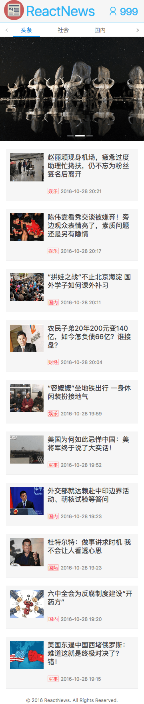

# ReactNews
###React-demo 适配PC及移动端的新闻平台；
###Reactjs && ES6 && webpack && ant design && fetch && React-router。
###真实外部API接口开发。
借由这个项目也进一步的了解React的好处：完全组件化开发，virtual dom减少DOM操作提高浏览器的渲染性能，可以无缝衔接react-native写移动应用。唯一要吐槽的是写个项目要引用的包太多了，能不能统一打包啊！！



## 运行程序

克隆项目

```
> $ git clone https://github.com/Tongwenfan/ReactNews.git
```

分别进入ReactNews目录和server目录下安装依赖包

```
> $ npm install
```


在react目录下启动webpack服务

```
> $ npm run dev
```

执行完`npm run dev`命令后，打开浏览器 `http://localhost:8000/`运行项目；
